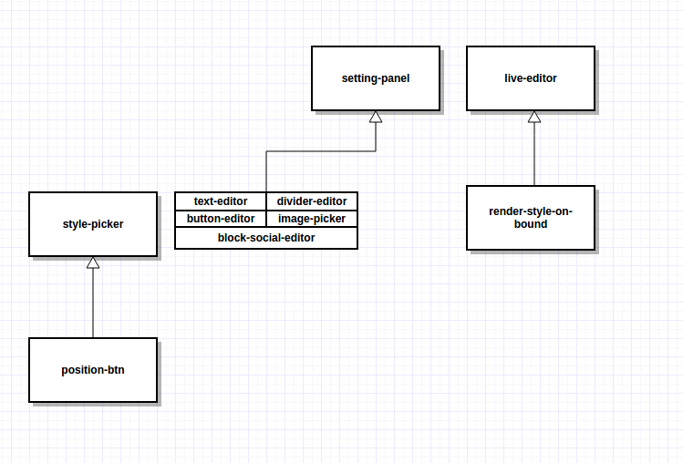

# newsletter-editor

## Gérer les dépendances

Avant de démarrer l'application, il est nécessaire de télécharger les dépendances.

`npm install` Pour les node_modules
`bower install` pour les bower_components.

## Build & development

Run `grunt` for building and `grunt serve` for preview.

## Testing

L'application possède des test unitaires, situé dans `test/spec`

Ces tests sont utiles pour comprendre le fonctionnement de chaque directive ainsi que vérifier le bon
fonctionnement de l'application. 

Karma va lancer Google Chrome pour effectuer la batterie de test. 

`./node_modules/karma/bin/karma start test/karma.conf.js`

Puis on ouvre la navigateur à l'adresse indiqué (généralement localhost:8081).

## Architecture

L'application est décomposé en directive.

